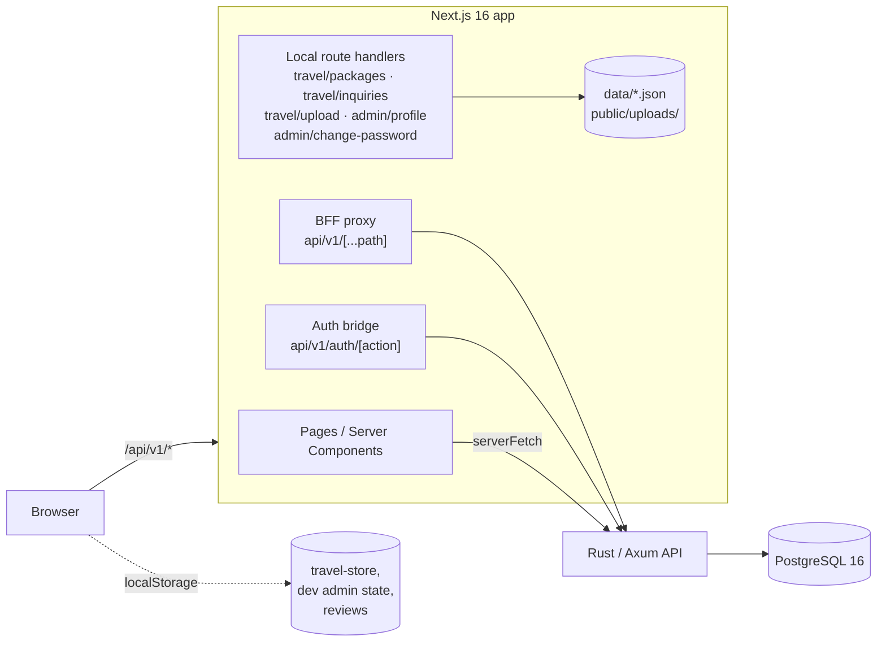
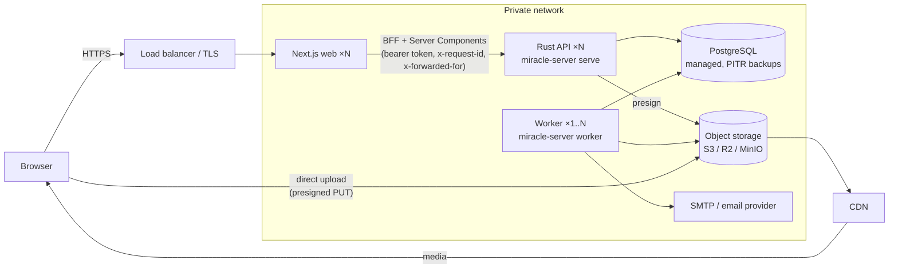

# Miracle International — Target Architecture

Status: proposal · Baseline: `develop` at `d4681df` (2026-09-30)

This document reviews the architecture as it exists in the repository today, lists the problems that will block growth, and defines the target architecture the team should converge on. It is deliberately incremental: the stack stays the same (Next.js 16 + Rust/Axum + PostgreSQL), no microservices are introduced, and every change is tied to a concrete problem found in the code.

---

## 1. Current architecture (baseline)



What is in place and working well:

- **Frontend structure.** Domain-oriented `src/features/*` modules with `api / hooks / components / schemas / types`, a public `index.ts` per feature, TanStack Query with hierarchical keys, Zod schemas separated from components, shared `DataTable`, and a centralised endpoint registry ([`lib/api/endpoints.ts`](../src/lib/api/endpoints.ts)).
- **BFF pattern.** Tokens live in HTTP-only cookies; the browser never sees the Rust origin ([`api/v1/[...path]/route.ts`](../src/app/api/v1/[...path]/route.ts), [`api/v1/auth/[action]/route.ts`](../src/app/api/v1/auth/[action]/route.ts)).
- **Server-side authorisation layer.** The DAL in [`src/server/dal`](../src/server/dal) with `cache()`-memoised session lookup and `requirePermission()` per page.
- **Backend foundation.** Axum with a consistent success/error envelope ([`server/src/error.rs`](../server/src/error.rs)), Argon2 password hashing, sqlx migrations, graceful shutdown, pooled Postgres connections.
- **Conventions.** Money in minor units with currency, ISO dates, typed permission list, strict TypeScript, Vitest + Playwright.

The intent of the existing README is sound. The problems below are mostly places where the implementation has drifted from that intent.

---

## 2. Findings

Severity: **P0** must fix before any production traffic · **P1** blocks scaling or causes data loss · **P2** maintainability.

### 2.1 Security and correctness

| # | Sev | Finding | Evidence |
|---|-----|---------|----------|
| F1 | P0 | **Authentication bypass.** Any request carrying the cookie `mi_session=temp-admin-session` (or `dev-admin-session`) is treated server-side as a `super_admin` with every permission. The value is a public constant, and the password `Admin@123` ships in the client bundle. | [`server/dal/session.ts`](../src/server/dal/session.ts) (`DEV_ADMIN_SESSION_TOKEN` check), [`lib/auth/dev-admin-auth.ts`](../src/lib/auth/dev-admin-auth.ts), [`features/auth/hooks/use-login.ts`](../src/features/auth/hooks/use-login.ts) |
| F2 | P0 | **Unauthenticated write endpoints in Next.js.** `POST/PUT/DELETE /api/v1/travel/packages`, `/travel/inquiries`, `/travel/upload` and `PUT /admin/profile` perform no auth check. Anyone can replace the entire package catalogue (`POST` with an array), read every inquiry (PII), or upload files. | [`api/v1/travel/*`](../src/app/api/v1/travel), [`api/v1/admin/profile/route.ts`](../src/app/api/v1/admin/profile/route.ts) |
| F3 | P0 | **Change password is a no-op** that reports success. | [`api/v1/admin/change-password/route.ts`](../src/app/api/v1/admin/change-password/route.ts) |
| F4 | P0 | **Missing authorisation in Rust.** `POST /travel/packages` and `GET /travel/inquiries` only require *a* valid token; self-registered users get one. Role checks elsewhere are ad-hoc string compares (`role != "admin"`). | [`server/src/routes/travel.rs`](../server/src/routes/travel.rs), [`admin.rs`](../server/src/routes/admin.rs) |
| F5 | P0 | **Insecure defaults.** `JWT_SECRET` silently falls back to a hard-coded value; CORS allows any origin; an admin user with a committed password hash is seeded by a schema migration. | [`config.rs`](../server/src/config.rs), [`middleware/cors.rs`](../server/src/middleware/cors.rs), [`migrations/…_init_schema.sql`](../server/migrations/20260929000001_init_schema.sql) |
| F6 | P1 | **Frontend ↔ backend contract is broken.** Rust serialises `snake_case` (`access_token`, `first_name`) and returns a single `role` string; the BFF and DAL expect `camelCase` (`accessToken`, `firstName`) plus `roles[]` and `permissions[]`. Real logins therefore never set a session cookie, and `/auth/me` maps to a user with no roles. Rust has no `refresh`, `verify-email` or `change-password` endpoints although the BFF proxies them. | [`models/user.rs`](../server/src/models/user.rs) vs [`auth/[action]/route.ts`](../src/app/api/v1/auth/[action]/route.ts) and `toSessionUser()` |
| F7 | P1 | **Public lead forms discard data.** Contact, visa, flight and import/export forms show a success toast and send nothing. | e.g. [`contact-form.tsx`](../src/features/contact/components/contact-form.tsx) `onSubmit` |
| F8 | P1 | **8 admin pages have no server-side permission check** (`admin/`, `dashboard`, `inquiries`, `payments`, `profile`, `tour/*`). The layout's `verifySession()` only proves a session exists. | `src/app/(portal)/admin/**/page.tsx` |

### 2.2 Scalability bottlenecks

| # | Sev | Finding |
|---|-----|---------|
| S1 | P1 | **Three competing sources of truth for travel data:** Postgres (Rust), JSON files under `data/`, and browser `localStorage` ([`lib/storage/travel-store.ts`](../src/lib/storage/travel-store.ts)) that syncs *the whole array* back to the server. Last writer wins; one admin's stale browser overwrites another's changes. |
| S2 | P1 | **Local filesystem persistence** (`data/*.json`, `public/uploads/`) cannot work with more than one Next.js instance, is lost on redeploy in container/serverless hosts, and read-modify-write of a whole file under concurrent requests corrupts or drops records. `GET /travel/packages` even *writes* the file on every read. |
| S3 | P1 | **Unbounded list endpoints.** Rust lists silently truncate at `LIMIT 50/100` with no pagination (orders, quotations, requirements, inquiries, users). Next.js routes return entire files. |
| S4 | P2 | **No indexes** beyond primary/unique keys. Every list filters on `status`, `customer_id`, `user_id`, `category`, `created_at`. |
| S5 | P2 | **Public pages cannot be cached.** Package detail is fetched client-side from the unauthenticated JSON route ([`package-detail-client.tsx`](../src/app/(public)/travel-tourism/packages/[slug]/package-detail-client.tsx)), so the Cache Components setup in [`next.config.ts`](../next.config.ts) gives no benefit and SEO suffers. |
| S6 | P2 | **Synchronous side effects have nowhere to go.** Emails (inquiry acknowledgement, password reset, verification) and image processing would run inside request handlers; there is no job mechanism. |

### 2.3 Coupling and separation of responsibilities

| # | Sev | Finding |
|---|-----|---------|
| C1 | P1 | **Rust handlers do everything**: HTTP parsing, authorisation, business rules, SQL and response shaping in one function. No service or repository layer, so nothing is unit-testable without HTTP + a database. |
| C2 | P2 | **Config is re-read from the environment on every request** (`Config::from_env()` inside the auth extractor and login/register), including `dotenv()` file I/O. There is no shared `AppState`; router state is just the pool. |
| C3 | P2 | **Dependency direction is inverted in the frontend.** Route handlers and `lib/storage` import types from `components/admin-travel/types.ts`; domain code lives in `components/admin-*` and `components/travel` instead of `features/`. |
| C4 | P2 | **Two role models.** Frontend defines 16 roles and a permission matrix ([`lib/permissions/roles.ts`](../src/lib/permissions/roles.ts)); backend has one free-text `role` column with four values. Nothing keeps them in sync. |
| C5 | P2 | **Hand-written wire types on both sides** with no generated contract — the direct cause of F6. |

### 2.4 Maintainability

- Duplicate admin route trees: `admin/tour/*`, `admin/tours/*`, `admin/travel/*`.
- Duplicate components: `admin-dashboard/status-badge.tsx` vs `data-display/status-badge.tsx`; client-side `AdminAuthGuard` duplicating the DAL.
- Hard-coded image-URL patching and deprecated-ID filtering inside storage code (`travel-store.ts`, `travel/packages/route.ts`) — data migrations disguised as runtime logic.
- `sourcing_requirements.target_budget_usd NUMERIC` breaks the minor-units money rule.
- Status columns are free text with no `CHECK` constraint; allowed transitions exist only in frontend constants.
- `sqlx::query_as` with `SELECT *` strings — no compile-time checking of SQL against the schema.

### 2.5 Reliability and operability

- `/health` always reports `"PostgreSQL connected"` without touching the database.
- `request_id` exists in the error envelope but is never populated; the BFF only forwards `x-request-id` if the browser sent one.
- Migrations run on every app start (acceptable at one instance; see §4.9).
- No request timeout or body-size limit in Axum (`tower-http` `timeout` feature is compiled in but unused).
- The BFF does not forward the client IP, so the API cannot rate-limit per client.
- Only three unit test files; no backend tests; no CI definition in the repository.

---

## 3. Target architecture

### 3.1 Principles

1. **One source of truth.** All business data lives in PostgreSQL and is reached only through the Rust API. Next.js holds no business state.
2. **Modular monolith.** One Rust binary, split into domain modules with explicit boundaries. Modules can be extracted later if a real need appears; nothing is distributed now.
3. **Layered, one direction.** HTTP → service → repository → database. Business rules sit in services and are testable without HTTP.
4. **The Rust API is authoritative for security.** Next.js checks are for UX and defence in depth.
5. **Contract generated, not hand-copied.** The API schema is produced from Rust types and the TypeScript types are generated from it.
6. **Boring infrastructure first.** Postgres also serves as the job queue; object storage for files; Redis only when a measured need arrives.

### 3.2 System view



- **Web tier (Next.js):** rendering, public-page caching, BFF (cookie ↔ bearer token), UX-level auth. Stateless, horizontally scalable.
- **API tier (Rust `serve`):** all business logic, authorisation, validation, persistence. Stateless, horizontally scalable. Not reachable from the internet.
- **Worker (Rust `worker`):** same binary and codebase, different entry command. Runs background jobs from the Postgres `jobs` table.
- **PostgreSQL:** system of record and job queue.
- **Object storage + CDN:** package images, documents, avatars. Browsers upload directly with presigned URLs; neither tier streams file bytes.

### 3.3 Backend module structure

```text
server/
├── Cargo.toml
├── migrations/                     sqlx migrations (schema only — no seed users)
└── src/
    ├── main.rs                     CLI entry: serve | worker | migrate | seed-admin
    ├── app.rs                      Router assembly + middleware stack
    ├── config.rs                   Loaded once at startup, validated, fail-fast
    ├── state.rs                    AppState { db, config, jwt, storage, mailer, jobs }
    │
    ├── http/                       Cross-cutting HTTP concerns, no domain logic
    │   ├── error.rs                AppError → envelope (+ request_id)
    │   ├── response.rs             ApiResponse, ApiMeta, Paginated
    │   ├── extract/                AuthUser, RequirePermission<P>, ValidatedJson<T>, PageParams
    │   └── middleware/             request_id, cors, rate_limit, timeouts, body_limit
    │
    ├── modules/                    One folder per business domain
    │   ├── identity/               users, roles, sessions, refresh tokens, password reset, email verification
    │   ├── catalog/                travel packages (later: products, wholesale categories)
    │   ├── inquiries/              ALL inbound leads: contact, travel, visa, flight, import/export, service requirement
    │   ├── sourcing/               requirements → quotations
    │   ├── orders/                 orders, status transitions, (later) payments, tracking
    │   ├── media/                  presign, confirm, media records
    │   └── reporting/              admin dashboard aggregates
    │       Each module:
    │       ├── mod.rs              pub fn router() + pub service API (the module's only public surface)
    │       ├── routes.rs           HTTP handlers: extract → call service → respond
    │       ├── service.rs          business rules, authorisation decisions, transactions
    │       ├── repo.rs             SQL (sqlx::query_as! compile-checked)
    │       ├── model.rs            domain types + status enums with allowed transitions
    │       └── dto.rs              request/response types (serde camelCase, validator, utoipa)
    │
    └── platform/                   Infrastructure adapters behind traits
        ├── db.rs                   pool, transactions helper
        ├── jobs/                   enqueue(tx, job) · worker loop (FOR UPDATE SKIP LOCKED) · retry/backoff
        ├── storage.rs              trait ObjectStorage { presign_put, presign_get, delete } + S3 impl
        ├── mailer.rs               trait Mailer + SMTP impl + in-memory fake for tests
        └── auth.rs                 JWT sign/verify, Argon2, token hashing
```

**Dependency rules** (enforced in review; each rule has a reason):

- `routes → service → repo`. Handlers never contain SQL; repos never make authorisation decisions. *Reason:* services become unit-testable, and rules are not duplicated across handlers.
- A module may call another module **only through that module's `mod.rs` public service functions**, never its repo. *Reason:* keeps extraction possible and prevents cross-module table coupling.
- `platform/` and `http/` depend on no module. *Reason:* no cycles.
- Side effects that leave the process (email, image processing, webhooks) are **enqueued in the same transaction** as the data change, never executed inline. *Reason:* no lost emails on crash, no slow requests.

### 3.4 Frontend structure

The existing layout stays. Changes are about finishing the migration into it and removing what bypasses it.

```text
src/
├── app/
│   ├── (public)/  (auth)/  (portal)/       routes only; every portal page calls the DAL
│   └── api/v1/
│       ├── auth/[action]/route.ts          cookie ↔ token bridge (keep)
│       └── [...path]/route.ts              BFF proxy (keep; add request-id + client IP)
│       ✗ travel/*, admin/profile, admin/change-password   → removed; served by Rust via the proxy
├── server/
│   ├── dal/                                session, permissions (dev backdoor removed)
│   └── http/
│       ├── server-api-client.ts            authenticated server fetch (keep)
│       └── public-api-client.ts            NEW: cookie-free fetch for cacheable public reads
├── features/
│   ├── travel/          absorbs components/admin-travel, components/travel, lib/storage (as API + hooks)
│   ├── inquiries/       NEW: one submit API/hook used by contact, visa, flight, import-export, travel forms
│   ├── admin-dashboard/ absorbs components/admin-dashboard
│   ├── profile/         absorbs components/admin-profile
│   └── …existing features unchanged
├── components/          domain-free shared UI only
└── lib/api/generated/   NEW: TypeScript types generated from the Rust OpenAPI document
```

**Frontend dependency rules**, enforced with ESLint `no-restricted-imports`:

- `app → features → (components | lib)`. `components/` and `lib/` never import from `features/`.
- Cross-feature imports go through `@/features/<name>` only.
- Only `server/http/*` may know `RUST_API_URL`. Only `lib/api/client.ts` may call `fetch('/api/...')` — no raw `fetch` in components.
- No `localStorage` for business data. Allowed only for UI preferences.

### 3.5 Communication flows

**Public read (cached)** — travel package list and detail pages:

```text
Server Component
  → features/travel/api/travel.server.ts   'use cache' · cacheTag('travel-packages') · cacheLife('hours')
  → public-api-client (no cookies)
  → Rust GET /api/v1/catalog/packages       public, published only
  → Postgres
```

The page shell and package HTML are prerendered and served from cache; SEO gets full content. Only dynamic parts (the inquiry modal) are client components.

**Admin mutation that affects public content:**

```text
Admin form (client) → Server Action updatePackage()
  → requirePermission('travel.manage')            DAL, defence in depth
  → serverFetch PUT /api/v1/catalog/packages/:id  Rust: RequirePermission(travel.manage), validation, audit log
  → updateTag('travel-packages')                  public cache refreshed, admin sees own write
```

Pure portal data (orders, quotations, inquiries lists) keeps the existing path: `hook → apiClient → BFF [...path] → Rust`, uncached, with TanStack Query handling client caching and invalidation via query keys.

**Public lead submission** (fixes F7):

```text
Contact / visa / flight / import-export / travel form
  → features/inquiries useSubmitInquiry()
  → BFF → Rust POST /api/v1/inquiries        rate-limited per IP, ValidatedJson<CreateInquiry>
      BEGIN
        INSERT inquiries (type, contact fields, details JSONB, source_page)
        INSERT jobs ('inquiry.notify_staff'), ('inquiry.acknowledge_customer')
      COMMIT
  ← 201 { id, reference }
Worker → picks jobs → Mailer → marks done / retries with backoff → 'dead' after N attempts
```

**Authentication:**

```text
login     → BFF → Rust: verify Argon2 → access JWT (15 min) + opaque refresh token (30 d, SHA-256 stored)
          ← BFF sets mi_session / mi_refresh HTTP-only cookies, strips tokens from body
request   → BFF attaches Bearer; Rust verifies JWT with key from AppState (no per-request env reads)
401       → lib/api/interceptors calls /auth/refresh once → Rust rotates refresh token
            (reuse of a rotated token revokes the whole family) → retry original request
logout    → Rust revokes refresh token → BFF clears cookies
/auth/me  → { id, email, firstName, lastName, roles[], permissions[], emailVerified }
```

**File upload:**

```text
client → Rust POST /media/presign {purpose, contentType, size}   permission + type/size validated
       ← { uploadUrl, mediaId }
client → PUT file directly to object storage
client → Rust POST /media/:id/confirm → media row 'ready' → job 'media.generate_variants'
```

---

## 4. Cross-cutting design

### 4.1 API design and contract

- Keep `/api/v1`, the `{ success, data, meta? }` / `{ success: false, error }` envelope, and error codes.
- **All JSON is `camelCase`** (`#[serde(rename_all = "camelCase")]` on every DTO). Database models are never serialised directly; DTOs are.
- **Every list endpoint is paginated** with `page`/`pageSize` (max 100) and returns pagination in `meta.pagination` (the `ApiMeta` type already supports this). Keyset pagination can replace offset later on hot tables without changing the envelope.
- Consistent filtering/sorting parameters: `?status=…&sort=-createdAt`.
- **OpenAPI from code** with `utoipa` on DTOs and handlers; CI generates `src/lib/api/generated/` with `openapi-typescript` and fails if the committed file is stale. This removes the class of bug in F6.
- Public `POST` endpoints accept an optional `Idempotency-Key` header so double-submits do not create duplicate inquiries.
- Resource naming by module: `/catalog/packages`, `/inquiries`, `/sourcing/requirements`, `/sourcing/quotations`, `/orders`, `/media`, `/identity/users`, `/reports/summary`. Update [`lib/api/endpoints.ts`](../src/lib/api/endpoints.ts) accordingly.

### 4.2 Authentication and authorisation

- **Remove the dev admin backdoor entirely** (F1). Local development uses a real account created by `miracle-server seed-admin --email … ` which reads the password from an environment variable, never from a migration or source file.
- **Short-lived access tokens + rotating refresh tokens** using the existing `refresh_tokens` table (add `family_id`, `replaced_by`, `user_agent`, `ip`).
- **RBAC owned by the backend.** Tables `roles`, `user_roles` (a user can hold several roles, which the frontend already assumes). The role → permission matrix lives in one Rust module; `/auth/me` returns effective permissions. The permission list is exported through OpenAPI so [`lib/permissions/permissions.ts`](../src/lib/permissions/permissions.ts) is generated, not hand-maintained.
- **`RequirePermission` extractor** on every non-public handler replaces `if role != "admin"` checks. Ownership checks (customer sees only own orders) stay in services.
- **Rate limiting** (`tower_governor`) on `/auth/*` and public `POST`s, keyed by the client IP the BFF forwards in `x-forwarded-for` (trusted only from the web tier).
- Password reset and email verification via single-use hashed tokens in a `user_tokens` table, delivered by the job queue.
- **Audit log** table (`actor_id, action, entity, entity_id, diff JSONB, request_id, at`) written by services for admin mutations.
- Config fails fast when `JWT_SECRET` is missing or shorter than 32 bytes outside development. CORS is disabled in production (the API is only called server-to-server); in development it is limited to `FRONTEND_URL`.

### 4.3 Database

| Change | Reason |
|--------|--------|
| Unified `inquiries` table (`type`, contact columns, `details JSONB`, `status`, `assigned_to`, `source_page`) replacing `travel_inquiries` | One admin inbox and one pipeline for every lead form; adding a new form is a new `type`, not a new table |
| `roles`, `user_roles`, `user_tokens`, `audit_log`, `media`, `jobs` tables | See §4.2, §4.4, §4.6 |
| `CHECK` constraints (or Postgres enums) on every `status` column; transition rules in `model.rs` | Invalid states become impossible instead of merely unlikely |
| Indexes: `(status, created_at DESC)` on inquiries/orders/quotations/requirements; `(customer_id, created_at DESC)` on orders/quotations; `(user_id)` on requirements; `(category, is_published)` on travel_packages; `(user_id)` on refresh_tokens | Every current list query filters on these |
| `updated_at` maintained by a trigger | Currently never updated |
| `target_budget_usd NUMERIC` → `target_budget_minor BIGINT` + `currency` | Consistent with the money convention |
| Reconcile `travel_packages` with the frontend `TravelPackage` shape (gallery images, travel type, currency) before migrating the JSON data | The JSON files carry fields the table does not |
| Remove the admin seed `INSERT` from migrations | Credentials do not belong in schema history |
| `sqlx::query_as!` macros + `cargo sqlx prepare` (offline mode) | SQL is checked against the schema at compile time |
| Session-level `statement_timeout` (e.g. 5 s) on the pool | A bad query cannot hold a connection indefinitely |

**Scaling path, in order, only when metrics justify each step:** indexes and query fixes → connection pooling via PgBouncer when API instances × pool size approaches `max_connections` → read replica for `reporting` queries → materialised views for dashboard aggregates → table partitioning of `audit_log`/`jobs` by month. None of these require changes to module boundaries.

### 4.4 Asynchronous processing

A Postgres-backed job queue, not a message broker:

```sql
jobs (id, kind, payload JSONB, status, attempts, max_attempts, run_at, locked_until, last_error, created_at)
-- worker: SELECT … WHERE status='queued' AND run_at <= now() ORDER BY run_at
--         FOR UPDATE SKIP LOCKED LIMIT 10
```

- Enqueued inside the business transaction (transactional outbox), so a job exists if and only if the data change committed.
- Exponential backoff; `dead` status after `max_attempts`, visible on an admin page.
- Handlers must be idempotent (at-least-once delivery).
- Initial job kinds: `inquiry.notify_staff`, `inquiry.acknowledge_customer`, `identity.send_verification`, `identity.send_password_reset`, `media.generate_variants`, `quotation.expire` (scheduled).

**Why not RabbitMQ/Kafka/Redis queues:** throughput needs are in the tens of jobs per minute; Postgres handles thousands per second with `SKIP LOCKED`, adds no infrastructure, and gives transactional enqueue for free. Revisit only if job volume or fan-out requirements change by orders of magnitude.

### 4.5 Caching

| Layer | What | How |
|-------|------|-----|
| CDN | Static assets, media | Immutable URLs (content hash / media id) with long `Cache-Control` |
| Next.js Cache Components | Public catalogue and marketing data | `'use cache'` + `cacheTag` + `cacheLife`; invalidated by `updateTag`/`revalidateTag` after admin mutations |
| TanStack Query | Portal data per user | Existing query-key hierarchy; no server cache for user-specific data |
| Rust | Nothing initially | Add an in-process cache (e.g. `moka`) only for measured hot reads such as the permission matrix |

When the web tier runs more than one instance, the default in-memory cache is per instance, so tag invalidation only reaches the instance that handled the mutation. At that point configure a shared cache via `cacheHandlers` in `next.config.ts` (Redis-backed) — **this is the first concrete reason to add Redis**, and the same instance can then back distributed rate limiting. Until then, run one web instance or keep `cacheLife` short.

### 4.6 File storage

- S3-compatible object storage (MinIO in docker compose for development, S3/R2 in production) behind the `ObjectStorage` trait.
- Presigned direct uploads (the endpoint registry already anticipates `documents.presign`). `media` table records owner, purpose, content type, size, status.
- Remove `public/uploads/` and `api/v1/travel/upload`. `next.config.ts` `images.remotePatterns` is narrowed from `hostname: "**"` to the CDN host.

### 4.7 Logging, monitoring and tracing

- **Request IDs end to end.** BFF generates `x-request-id` when absent and forwards it; Axum `SetRequestIdLayer` + `PropagateRequestIdLayer`; included in every log line, every error envelope (`requestId`), and every job enqueued by that request.
- **Structured logs.** JSON `tracing-subscriber` output in production; Next.js server logs through a small structured logger instead of `console.error`. Never log tokens, passwords or full inquiry bodies.
- **Health.** `/health/live` (process up) and `/health/ready` (runs `SELECT 1`, checks migrations are current). The load balancer uses readiness.
- **Metrics.** Prometheus `/metrics` on an internal port: request rate/latency/status per route, DB pool usage, job queue depth and failure count.
- **Errors.** Sentry (or equivalent) in both Next.js (`instrumentation.ts`) and Rust, tagged with request ID and release.
- **Alerts** to start with: 5xx rate, p95 latency, readiness failures, dead jobs > 0, DB connections > 80 %.

OpenTelemetry tracing is a later, optional step; request-ID correlation covers most debugging needs at this size.

### 4.8 Fault tolerance

- Axum: `TimeoutLayer` (e.g. 15 s, below the BFF's `RUST_API_TIMEOUT_MS`), `RequestBodyLimitLayer` (1 MB; files never pass through the API), panics converted to 500 envelopes (`CatchPanicLayer`).
- BFF: keep timeouts; retry **only idempotent GETs**, once, on network errors — never POSTs.
- Public pages degrade gracefully: cached content is served even if the API is briefly down.
- Graceful shutdown (already present) extended to the worker: finish in-flight jobs, release locks.
- Postgres: managed service with point-in-time recovery; restore tested quarterly.
- Idempotency keys on public submits; idempotent job handlers.

### 4.9 Deployment and delivery

**Environments:** local (docker compose: Postgres, MinIO, Mailpit; API via `cargo run`, web via `npm run dev`), staging (production-like, seeded with anonymised data), production.

**Artifacts:** two images — `web` (Next.js `output: "standalone"`) and `api` (Rust, multi-stage build, distroless). The same `api` image runs as `serve`, `worker`, or `migrate`.

**Release order:** `migrate` runs once as a release step (sqlx takes an advisory lock, but a separate step keeps app start fast and makes failed migrations stop the deploy) → `api` rolling update → `worker` → `web`. Migrations are backwards-compatible with the previous release (expand → migrate → contract).

**Starting topology:** 1–2 web, 2 API, 1 worker, managed Postgres, object storage + CDN. A PaaS or a single VM with docker compose is sufficient; Kubernetes is not needed at this size.

**CI (per pull request):**

- Web: `npm run validate`, `next build`.
- API: `cargo fmt --check`, `cargo clippy -D warnings`, `cargo test` against a Postgres service container, `cargo sqlx prepare --check`.
- Contract: regenerate OpenAPI → TypeScript; fail on diff.
- E2E: Playwright against the compose stack for auth, inquiry submission and package management.

---

## 5. Keep / change / remove

| Area | Decision | Why |
|------|----------|-----|
| Next.js 16 App Router, Cache Components, feature modules, BFF, HTTP-only cookies, DAL, TanStack Query, Zod, shared UI kit | **Keep** | Sound, already aligned with the target |
| Rust + Axum + sqlx + PostgreSQL, response envelope, Argon2, graceful shutdown | **Keep** | Right tools for the job; no reason to change stack |
| Money in minor units, ISO dates, endpoint registry, hierarchical query keys | **Keep** | Good conventions; extend to backend (`target_budget_minor`) |
| Rust handler-does-everything structure | **Change** → modules with routes/service/repo | Testability, reuse, clear ownership (C1) |
| `Config::from_env()` per request, pool-only router state | **Change** → `AppState` built once | Performance, fail-fast config (C2, F5) |
| Single `role` column, string role checks | **Change** → `roles`/`user_roles` + permission extractor | Matches the 16-role frontend model (C4, F4) |
| snake_case, hand-written wire types | **Change** → camelCase DTOs + OpenAPI-generated TS types | Fixes the broken auth contract (F6, C5) |
| `travel_inquiries` + four forms that post nowhere | **Change** → unified `inquiries` module | Captures lost leads with one pipeline (F7) |
| Unpaginated lists with hidden `LIMIT` | **Change** → paginated everywhere | Correctness at scale (S3) |
| Client-fetched package detail | **Change** → cached Server Component | Performance, SEO (S5) |
| `components/admin-*`, `components/travel`, `lib/storage` | **Change** → move into `features/*` | Correct dependency direction (C3) |
| Migrations at app start | **Change** → release step | Safe multi-instance deploys |
| `lib/auth/dev-admin-auth.ts` and its uses in DAL, login hook, auth provider, sidebar, user menu | **Remove** | Authentication bypass (F1) |
| `api/v1/travel/{packages,inquiries,upload}`, `api/v1/admin/{profile,change-password}` | **Remove** | Unauthenticated, file-based, duplicate of Rust (F2, F3, S2) |
| `data/*.json`, `public/uploads/`, `lib/storage/travel-store.ts`, `localStorage` business data (incl. package reviews) | **Remove** (after one-off import into Postgres) | Single source of truth (S1, S2) |
| `AdminAuthGuard` client component | **Remove** | Duplicates the DAL, trusts `localStorage` |
| Admin seed in migration, default `JWT_SECRET`, `CorsLayer::allow_origin(Any)` | **Remove** | Insecure defaults (F5) |
| Duplicate `admin/tour/*` and `admin/tours/*` trees, duplicate `StatusBadge` | **Remove** after confirming the canonical route with product | Maintainability |

---

## 6. Key improvements over the current architecture

1. **Secure by construction.** The backdoor and open write endpoints are gone; every protected Rust handler declares its permission; the frontend's role model and the backend's are the same model.
2. **Horizontally scalable tiers.** Web and API hold no local state, so both can run N instances behind a load balancer. The worker scales independently.
3. **One source of truth.** Postgres behind the Rust API replaces three competing stores, eliminating lost updates between admins.
4. **No more lost leads.** Every public form writes to a single `inquiries` pipeline with staff notification and customer acknowledgement delivered reliably through the job queue.
5. **Contract safety.** Generated types turn backend/frontend drift into a CI failure instead of a production outage.
6. **Testable backend.** Business rules live in services with trait-based adapters (storage, mailer), so they can be tested without HTTP or external services.
7. **Fast public site.** Catalogue pages are prerendered and cached with tag-based invalidation; the CDN serves media.
8. **Operable.** Request-ID correlation, structured logs, real readiness checks, metrics and alerts make incidents diagnosable.
9. **Growth path without rewrites.** PgBouncer, read replicas, Redis-backed shared cache and module extraction are each isolated, optional steps triggered by measured need.

---

## 7. Migration roadmap

Each phase is independently shippable.

**Phase 0 — Stop the bleeding (days)**
1. Delete the dev admin backdoor (DAL check, login shortcut, `dev-admin-auth.ts`, `AdminAuthGuard`).
2. Remove or lock down the Next.js `travel/*` and `admin/*` route handlers.
3. Add `requirePermission` to the eight unguarded admin pages.
4. Rust: require `JWT_SECRET`, restrict CORS, add permission checks to `POST /travel/packages` and `GET /travel/inquiries`.

**Phase 1 — Make the real path work (1–2 weeks)**
1. `AppState`, config fail-fast, request-ID middleware, timeouts, body limits, live/ready health checks.
2. camelCase DTOs; `/auth/me` returns `roles[]` + `permissions[]`; `roles`/`user_roles` tables; `seed-admin` command.
3. Refresh-token rotation, logout revocation, change-password, BFF refresh-on-401.
4. `utoipa` + generated TypeScript types wired into CI.

**Phase 2 — Consolidate data (2–3 weeks)**
1. Restructure Rust into `modules/` (start with `identity`, `catalog`, `inquiries`).
2. Unified `inquiries` table + endpoint; connect all public forms.
3. Reconcile `travel_packages` schema; one-off import of `data/*.json`; switch admin travel UI to the API; delete JSON files, `lib/storage`, `localStorage` business data.
4. Object storage + presigned uploads; migrate existing uploads.
5. Pagination, indexes, status constraints.

**Phase 3 — Production hardening (1–2 weeks)**
1. Postgres job queue + worker; email delivery for inquiries, verification, password reset.
2. Cached public catalogue pages with tag invalidation via Server Actions.
3. Audit log, rate limiting, Sentry, metrics, alerts.
4. Dockerfiles, CI pipeline, staging environment, release-step migrations.

**Phase 4 — As the business grows (on demand)**
Sourcing → quotation → order workflow on the new module structure; payments/invoices modules; Redis-backed `cacheHandlers` when web runs multiple instances; PgBouncer/read replica when metrics call for it.

---

## 8. Deliberately not adopted

| Option | Why not now | Revisit when |
|--------|-------------|--------------|
| Microservices | One team, one database, low traffic; network boundaries would add latency, deployment and consistency cost with no benefit | A module has a genuinely different scaling, availability or ownership profile |
| Kafka / RabbitMQ | Postgres queue covers the volume with transactional enqueue | Sustained high-volume event streaming or many independent consumers |
| Redis (day one) | Nothing requires shared ephemeral state yet | Multiple web instances need a shared Next.js cache, or distributed rate limiting |
| Kubernetes | A handful of containers; a PaaS or compose deployment is simpler to operate | Many services or teams, autoscaling needs a PaaS cannot meet |
| GraphQL | REST + generated types fits the BFF model and caching | Many heterogeneous clients with divergent data needs |
| Headless CMS | Marketing copy changes rarely and is versioned in code | Non-developers need to edit content regularly |
